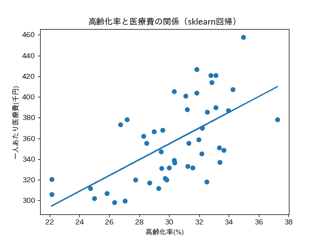

# aging-medical-cost-analysis
高齢化率と医療費の関係分析（都道府県別データ）

# 高齢化率と医療費の関係分析  
― 都道府県別データを用いた基礎分析 ―

## 概要

本プロジェクトでは、都道府県別の高齢化率と一人当たり医療費の関係について分析を行いました。  
日本では高齢化が進行しており、医療費の増大が社会的課題となっています。本分析では、高齢化率と医療費の関係を定量的に確認することを目的としました。

人口データと医療費データを結合し、高齢化率を算出したうえで、散布図・相関分析・回帰分析を行い、関係性の可視化および数値評価を実施しました。

---

## 使用データ

本分析では、以下の実データを使用しました。

### 人口データ
- 出典：総務省統計局  
- データ名：2020年 国勢調査  
- 内容：都道府県別 総人口・65歳以上人口  

### 医療費データ
- 出典：厚生労働省  
- データ名：2020年 都道府県別 一人当たり医療費  
- 内容：都道府県別 一人当たり医療費（千円）

---

## 分析の流れ

本分析は以下の手順で実施しました。

1. データの読み込み  
2. 不要列の削除などの前処理  
3. 高齢化率（％）の計算  
   - 65歳以上人口 ÷ 総人口 × 100  
4. 人口データと医療費データの結合  
5. 散布図の作成  
6. 相関係数の算出  
7. 回帰分析の実施  
8. 医療費ランキングの作成  
9. 結果の考察

---

## 使用技術

- Python  
- pandas  
- matplotlib  
- numpy  
- scikit-learn  
- Google Colab  

---

## 主な結果

本分析の主な結果は以下の通りです。

- 相関係数：**r = 0.616**  
- 決定係数：**R² = 0.380**

これにより、高齢化率が高い地域ほど医療費が高くなる傾向が確認されました。  
また、高齢化率は医療費の変動の約38%を説明できることが示されました。

---

## 可視化結果

高齢化率と一人当たり医療費の関係を散布図として可視化し、回帰直線を重ねて表示しました。  
これにより、両者の関係を視覚的に確認できるようにしました。

（※ここにNotebook内のグラフ画像を後で追加できます）

---

## 考察

本分析では、高齢化率と医療費の間に中程度の正の相関が確認されました。  
これは、高齢化の進行が医療費増加の一因であることを示唆しています。

一方で、決定係数が0.380であったことから、医療費には高齢化率以外の要因も影響していると考えられます。  
例えば、医療機関数、所得水準、人口密度などの要因が影響している可能性があります。

---

## 今後の課題

本分析では高齢化率のみを説明変数として使用しましたが、医療費には複数の要因が影響していると考えられます。

今後は以下のようなデータを追加し、多変量分析を実施することで、より詳細な要因分析を行いたいと考えています。

- 医療機関数  
- 平均所得  
- 人口密度  
- 疾病構造

---

## ファイル構成

project/
│
├── 高齢化率医療費.ipynb # 分析Notebook
├── population.csv # 人口データ
├── medical_cost.csv # 医療費データ
└── README.md # 本ファイル

---

## 作成者

データ分析ポートフォリオとして作成。
